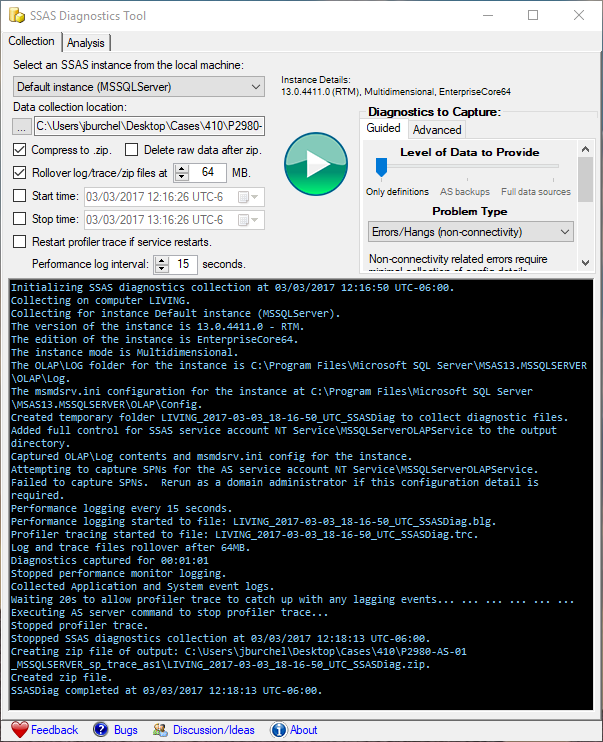
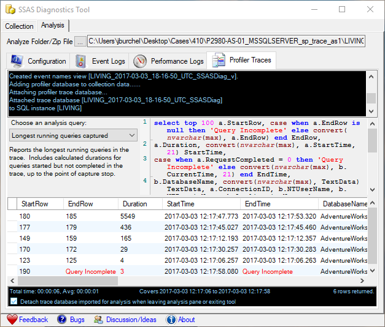

#### **†Note regarding SmartScreen warning on first run**
^^The first time the utility runs a warning may appear that _Windows protected your PC: SmartScreen prevented an unrecognized app from starting.  Running the app might put your PC at risk._  This occurs because the executable is unsigned and was downloaded from the Internet zone.  If you prefer you can clone the source code directly to open the solution in Visual Studio 2013 (or later) and build the executable directly yourself.  Browse the source code and all its history through the Source Code tab.^^

^^To skip this warning, just click More Info on the dialog, and then Run Anyway.  Thereafter the app will launch without this warning.^^

----
# SSAS Diagnostics Tool

The SSAS Diagnostics Collector (SSASDiag) is a simple and lightweight data collection utility with minimal dependencies.  It is self explanatory and runs directly on any server to capture data from any release of Analysis Services after SQL 2005, for efficient subsequent review and analysis.

The tool provides two primary functions:

## **[SSAS Diagnostics Tool - Collection](SSAS-Diagnostics-Tool---Collection)**

The Collection function allows collection of a range of key diagnostic data either through explicit selection or using a guided wizard based on the type of problem the server encounters.

## **[SSAS Diagnostics Tool - Analysis](SSAS-Diagnostics-Tool---Analysis)**

The tool also provides built in Analysis for data collected.  Currently there are two top priority analyzers provided:
* Network Traces analyzer reporting summary of details of errors or problems discovered.
* Profiler Trace Analyzer allowing in depth analysis, and automatic importation of traces to database for any range of subsequent investigation.  This feature exposes 60 unique paths to analyze significant features in a trace for findings very difficult to obtain by any other method.

# AS Profiler Trace Importer

For the AS Profiler Trace Importer tool, run the utility one time, and thereafter, just right click on any profiler trace to "Import profiler trace to SQL table":

After the first run, the tool remembers the last data connection used.  This makes importing new traces simple and direct.

The tool also spawns new threads - one per file in the rollover trace - and actively processes files in parallel, one per logical processing core on the system.  On a typical modern computer this may improve load time significantly, reducing execution time by as much as 85% in benchmarks with a 207 part trace file having just over 2 million rows.

The utility can help make investigating Analysis Services and SQL performance issues easier, automating and speeding a cumbersome, repetitive and slow activity administrators encounter frequently.  

The utility also optionally creates two views. One translates event names and converts the output's native TextData column from NTEXT to NVARCHAR, allowing easy querying and comparison of text in subsequent analysis. Another exposes the following statistics on each complete query captured from the trace (if Query Subcube events were captured): formula engine duration, storage engine duration, total query duration, and storage engine percentage.

