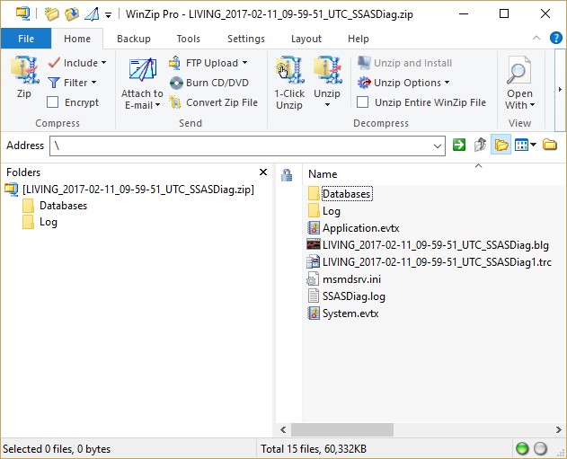

This site, formerly the AS Profiler Trace Importer site, now hosts that tool still, but also the new SSAS Diagnostics Collector tool as well.  Other utilities may be added in the future, and this will provide a single repository for a suite of AS diagnostics utilities.

# SSAS Diagnostics Tool

The SSAS Diagnostics Tool automates collection of SSAS diagnostics data against an SSAS instance, and provides built-in analysis for network traces and SSAS Profiler Traces in the current release.  It captures a lightweight server side SQL Profiler trace with optional additional details relevant for performance investigations, a Performance Monitor log, a Network Trace, and config and OLAP\log directory, and optionally compresses the results for easy transport and subsequent analysis.  The tool allows scheduling of specific times, configuration of rollover for all files, as well as all type of diagnostics collected, and is highly portable.

# AS Profiler Trace Importer

The AS Profiler Trace Importer tool automates import of large multi-part AS Profiler traces into SQL tables for subsequent analysis.  The prior best approach was to open these large files in SQL Server Profiler, a slow process itself, loading the files serially into a UI, and then use that tool to export to table, another long running serial task.  The tool provided provides one-click import, with maximum threading advantage on the system, to dramatically improve load times in some instances.  It also performs some limited basic analysis and creates views to ease subsequent analysis by an engineer.

Run the utility one time, and thereafter, just right click on any profiler trace to "Import profiler trace to SQL table":

After the first run, the tool remembers the last data connection used.  This makes importing new traces simple and direct.

The tool also spawns new threads - one per file in the rollover trace - and actively processes files in parallel, one per logical processing core on the system.  On a typical modern computer this may improve load time significantly, reducing execution time by as much as 85% in benchmarks with a 207 part trace file having just over 2 million rows.

The utility can help make investigating Analysis Services and SQL performance issues easier, automating and speeding a cumbersome, repetitive and slow activity administrators encounter frequently.  

The utility also optionally creates two views.  One translates event names and converts the output's native TextData column from NTEXT to NVARCHAR, allowing easy querying and comparison of text in subsequent analysis.  Another exposes the following statistics on each complete query captured from the trace (if Query Subcube events were captured): formula engine duration, storage engine duration, total query duration, and storage engine percentage.

