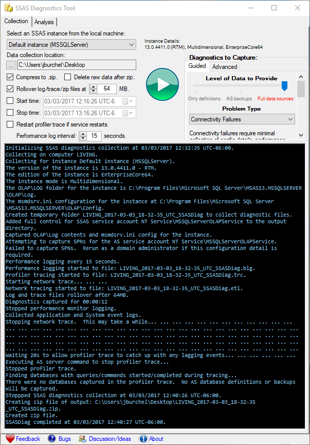
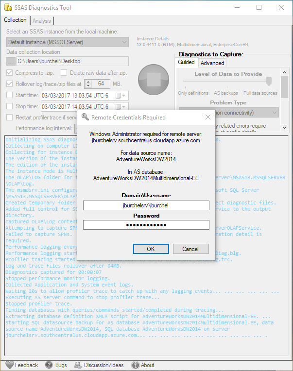

# SSAS Diagnostics Collector

The SSAS Diagnostics Tool (SSASDiag.exe) provides a simple, lightweight data collection utility to capture a range of diagnostics from Analysis Services servers encountering problems.  It requires minimal dependencies and is self explanatory.  It may be run directly on any server to capture data from any release of Analysis Services for efficient subsequent review and analysis.

The tool collects the following (all are optional/configurable):

* Detailed but lightweight server side SSAS profiler trace including relevant events we require to make analysis of the internal costs of various components of the AS engine, important for deep performance review.
* AS database definitions (XMLA CREATE scripts) for all databases with queries or commands either started or ended during the course of tracing, to allow review of data structures and calculations.
* SQL data source backups for all databases, including remote SQL sources, prompting user for remote administrator credentials if necessary for each collected data source.

* AS database backups (.abf files) for all databases with queries or commands either started or ended during the course of tracing, to allow reproducibility with the data, or editing of calculations to experiment with changes to them.
* Detailed specific comprehensive Performance Monitor logging with configurable interval to adjust as required per environment and circumstance.
* SSAS OLAP\Log folder containing recent flight recorder tracing from prior service runs, memory dumps from crashes on the server, and the service log file.
* The SSAS configuration file as obtained from the service startup parameters directly on the instance.
* Details of the specific build version, edition, and mode of the AS instance.
* Application and system event logs.
* AS service account SPNs.
* Network traces.
* A log in UTC time for easy reckoning confirming all the details collected by the tool, and elapsed time period it covered.
Features of the tool include:
* A Simple Wizard to guide users to selection of ideal diagnostics for several common problem types.
* Enumerates all instances of SQL Server Analysis Services on the local machine automatically.
* Supports all releases of SQL Server from 2005 through 2016.
* Highly portable with no dependencies other than default OS included .NET frameworks.  Tested on servers as old as 2008 with clean default installs, requiring no additional dependencies to run.
* Names all files consistently with server host name, AS instance name, time of capture in UTC format to avoid all ambiguity of analysis in disparate time zones.
* Rollover supported for logs to allow long running of the tool, so old logs failing to capture intermittent issues can be discarded without disrupting data capture.
* Automatic cleanup of all collection files.  A simple zip file (or rolled over series of them, if zip size also exceeds configured rollover size) is left and named in the same location as the initial .exe.
* No need to request elevation of privilege to run and correctly obtain administrative rights required for Performance Monitor logging locally with access to the SSAS binaries to load those counters specifically.  Instead, the tool automatically prompts for Administrator access when it is run so the user cannot forget to elevate credentials, potentially causing failure of collection then.
* Automatically self-updates and fully sandboxes itself to avoid any dependencies or cleanup.
* Built in bug reporting and feedback mechanism.
* Full schedulability of stop and start.
* Optional configuration to automatically restart Profiler tracing after service restart, to continue data collection, but enforcement of a check to include a hard stop time in that case, within 30 days of the present, to avoid accidentally configuring a long running trace and forgetting it, etc.
* Optional collection of default SQL Profiler trace or a detailed trace with all additional performance relevant events as well.
* Option to choose whether to compress to zip and/or delete raw data after capture.
* Options to enable/disable each type of diagnostic collected.
* Supported compatibility on Windows Server 2008 or later with SQL Analysis Services 2008 or later.